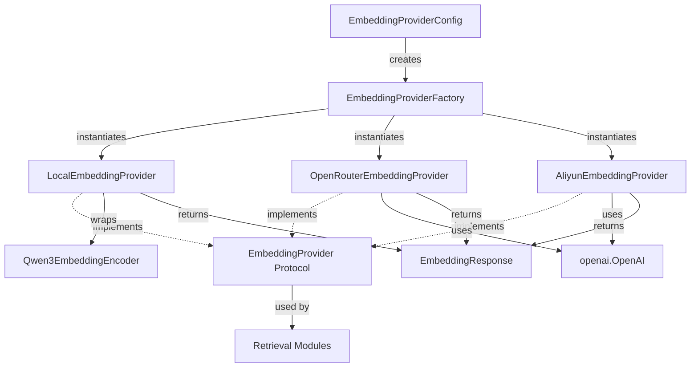

# Data Model: Cloud-Based Embedding Refactoring

**Branch**: `004-cloud-embedding-refactor` | **Date**: 2025-11-12

## Core Entities

### 1. EmbeddingProvider (Abstract Interface)

**Purpose**: Define contract for all embedding providers (local, OpenRouter, Aliyun)

**Type**: Python Protocol (abstract interface)

**Attributes**: N/A (interface only)

**Methods**:

```python
from typing import Protocol, Union, List
import numpy as np

class EmbeddingProvider(Protocol):
    """Abstract interface for embedding providers."""

    def encode(self, texts: Union[str, List[str]]) -> Union[np.ndarray, List[np.ndarray]]:
        """
        Generate dense embeddings for input text(s).

        Args:
            texts: Single text string or list of text strings

        Returns:
            - If single text: numpy array of shape (1024,)
            - If multiple texts: list of numpy arrays, each of shape (1024,)

        Raises:
            ValueError: If texts is empty or contains invalid inputs
            RuntimeError: If embedding generation fails (API errors, model errors)
        """
        ...

    def get_embedding_dimension(self) -> int:
        """
        Get the embedding dimension for this provider.

        Returns:
            Embedding dimension size (1024 for all current providers)
        """
        ...

    def get_provider_name(self) -> str:
        """
        Get the provider name for logging and debugging.

        Returns:
            Provider name string (e.g., "local_qwen3", "openrouter", "aliyun")
        """
        ...

    def validate_dimension(self, expected_dim: int) -> None:
        """
        Validate embedding dimension matches database schema.

        Args:
            expected_dim: Expected dimension from database schema

        Raises:
            ValueError: If actual dimension != expected dimension
        """
        ...
```

**Relationships**:
- Implemented by: `LocalEmbeddingProvider`, `OpenRouterEmbeddingProvider`, `AliyunEmbeddingProvider`
- Used by: `EmbeddingProviderFactory`, retrieval modules (`SimpleRetriever`, `RerankRetriever`, `AdvancedRetriever`)

**Validation Rules**:
- `encode_dense()` must return 1024-dimensional embeddings for all providers
- `encode_sparse()` must raise NotImplementedError for local and OpenRouter providers
- `get_embedding_dimension()` must return same value as actual encoding result
- `validate_dimension()` must be called during provider initialization

---

### 2. LocalEmbeddingProvider

**Purpose**: Wrapper for local Qwen3EmbeddingEncoder implementing EmbeddingProvider interface

**Type**: Concrete class implementing `EmbeddingProvider` protocol

**Attributes**:
- `encoder`: `Qwen3EmbeddingEncoder` instance (moved from src/embeddings/encoder.py)
- `device`: Device type ("mps", "cuda", "cpu")
- `batch_size`: Batch size for local inference (default: 16 for MPS)
- `normalize_embeddings`: Whether to L2 normalize embeddings (default: True)

**Methods**:
- `encode(texts)`: Generate dense embeddings using local Qwen3 model
- `get_embedding_dimension()`: Return 1024
- `get_provider_name()`: Return "local_qwen3"
- `validate_dimension(expected_dim)`: Encode test string and compare dimension

**Initialization**:
```python
from app.embeddings.local_encoder import Qwen3EmbeddingEncoder

class LocalEmbeddingProvider:
    def __init__(
        self,
        model_name: str = "Qwen/Qwen3-Embedding-0.6B",
        device: str = "mps",
        batch_size: int = 16,
        normalize_embeddings: bool = True,
    ):
        self.encoder = Qwen3EmbeddingEncoder(
            model_name=model_name,
            device=device,
            batch_size=batch_size,
            normalize_embeddings=normalize_embeddings,
        )
        self.device = device
        self.batch_size = batch_size
        self.normalize_embeddings = normalize_embeddings
```

**Relationships**:
- Depends on: `Qwen3EmbeddingEncoder` (moved from src/embeddings/encoder.py)
- Created by: `EmbeddingProviderFactory` when `embedding_provider="local"`

**Validation Rules**:
- Device must be one of: "mps", "cuda", "cpu"
- Batch size must be >= 1
- Model must load successfully during initialization

---

### 3. OpenRouterEmbeddingProvider

**Purpose**: Cloud embedding provider using OpenRouter API (Qwen3-Embedding-0.6B via API)

**Type**: Concrete class implementing `EmbeddingProvider` protocol

**Attributes**:
- `client`: `openai.OpenAI` client instance with custom base_url
- `model_name`: Model name ("qwen/qwen3-embedding-0.6b")
- `api_base`: API base URL ("https://openrouter.ai/api/v1")
- `api_key`: OpenRouter API key (from `settings.openai_api_key`)
- `batch_size`: Batch size for API calls (default: 100)
- `max_retries`: Maximum retry attempts (default: 3)
- `timeout`: Request timeout in seconds (default: 30)

**Methods**:
- `encode(texts)`: Call OpenRouter API with OpenAI client
- `get_embedding_dimension()`: Return 1024
- `get_provider_name()`: Return "openrouter"
- `validate_dimension(expected_dim)`: Encode test string and compare dimension
- `_encode_with_retry(texts)`: Internal method with exponential backoff retry logic

**Initialization**:
```python
from openai import OpenAI

class OpenRouterEmbeddingProvider:
    def __init__(
        self,
        api_key: str,
        api_base: str = "https://openrouter.ai/api/v1",
        model_name: str = "qwen/qwen3-embedding-0.6b",
        batch_size: int = 100,
        max_retries: int = 3,
        timeout: int = 30,
    ):
        self.client = OpenAI(
            base_url=api_base,
            api_key=api_key,
            timeout=timeout,
        )
        self.model_name = model_name
        self.api_base = api_base
        self.batch_size = batch_size
        self.max_retries = max_retries
```

**Relationships**:
- Depends on: `openai.OpenAI` client
- Created by: `EmbeddingProviderFactory` when `embedding_provider="openrouter"`

**Validation Rules**:
- API key must be non-empty string
- API base URL must be valid HTTPS URL
- Batch size must be >= 1
- Timeout must be > 0

---

### 4. AliyunEmbeddingProvider

**Purpose**: Cloud embedding provider using Aliyun text-embedding-v4 (OpenAI-compatible API)

**Type**: Concrete class implementing `EmbeddingProvider` protocol

**Attributes**:
- `client`: `openai.OpenAI` client instance with custom base_url
- `model_name`: Model name ("text-embedding-v4")
- `api_base`: API base URL ("https://dashscope.aliyuncs.com/compatible-mode/v1")
- `api_key`: Aliyun API key (from `settings.aliyun_api_key`)
- `batch_size`: Batch size for API calls (default: 100)
- `max_retries`: Maximum retry attempts (default: 3)
- `timeout`: Request timeout in seconds (default: 30)

**Methods**:
- `encode(texts)`: Call Aliyun API with OpenAI client
- `get_embedding_dimension()`: Return 1024
- `get_provider_name()`: Return "aliyun"
- `validate_dimension(expected_dim)`: Encode test string and compare dimension
- `_encode_with_retry(texts)`: Internal method with exponential backoff retry logic

**Initialization**:
```python
from openai import OpenAI

class AliyunEmbeddingProvider:
    def __init__(
        self,
        api_key: str,
        api_base: str = "https://dashscope.aliyuncs.com/compatible-mode/v1",
        model_name: str = "text-embedding-v4",
        batch_size: int = 100,
        max_retries: int = 3,
        timeout: int = 30,
    ):
        self.client = OpenAI(
            base_url=api_base,
            api_key=api_key,
            timeout=timeout,
        )
        self.model_name = model_name
        self.api_base = api_base
        self.batch_size = batch_size
        self.max_retries = max_retries
```

**Relationships**:
- Depends on: `openai.OpenAI` client
- Created by: `EmbeddingProviderFactory` when `embedding_provider="aliyun"`

**Validation Rules**:
- API key must be non-empty string
- API base URL must be valid HTTPS URL
- Batch size must be >= 1
- Timeout must be > 0

---

### 5. EmbeddingProviderFactory

**Purpose**: Factory for creating embedding providers based on configuration

**Type**: Factory class

**Attributes**: N/A (stateless factory)

**Methods**:

```python
from app.config import Settings
from app.embeddings.base import EmbeddingProvider

class EmbeddingProviderFactory:
    """Factory for creating embedding providers based on configuration."""

    @staticmethod
    def create_provider(settings: Settings) -> EmbeddingProvider:
        """
        Create embedding provider based on settings.embedding_provider.

        Args:
            settings: Application settings with provider configuration

        Returns:
            Embedding provider instance implementing EmbeddingProvider protocol

        Raises:
            ValueError: If embedding_provider not in ["local", "openrouter", "aliyun"]
            RuntimeError: If provider initialization fails
        """
        provider_type = settings.embedding_provider.lower()

        if provider_type == "local":
            from app.embeddings.local_encoder import LocalEmbeddingProvider
            return LocalEmbeddingProvider(
                model_name=settings.EMBEDDING_MODEL,
                device="mps",  # TODO: Make configurable
                batch_size=16,
                normalize_embeddings=True,
            )

        elif provider_type == "openrouter":
            from app.embeddings.openrouter_provider import OpenRouterEmbeddingProvider
            return OpenRouterEmbeddingProvider(
                api_key=settings.openai_api_key,
                model_name="qwen/qwen3-embedding-0.6b",
                batch_size=100,
            )

        elif provider_type == "aliyun":
            from app.embeddings.aliyun_provider import AliyunEmbeddingProvider
            return AliyunEmbeddingProvider(
                api_key=settings.aliyun_api_key,
                model_name="text-embedding-v4",
            )

        else:
            raise ValueError(
                f"Invalid embedding_provider: {provider_type}. "
                f"Must be one of: 'local', 'openrouter', 'aliyun'"
            )
```

**Relationships**:
- Creates: `LocalEmbeddingProvider`, `OpenRouterEmbeddingProvider`, `AliyunEmbeddingProvider`
- Used by: Retrieval factory, service initialization

**Validation Rules**:
- Provider type must be one of: "local", "openrouter", "aliyun" (case-insensitive)
- Required API keys must be present in settings based on provider type
- Provider initialization must succeed (models load, API connections establish)

---

### 6. EmbeddingProviderConfig (Settings Extension)

**Purpose**: Configuration parameters for embedding provider selection and API credentials

**Type**: Pydantic Settings extension

**New Configuration Fields**:

```python
from pydantic_settings import BaseSettings

class Settings(BaseSettings):
    # ... existing fields ...

    # Embedding Provider Selection
    embedding_provider: str = "local"  # "local", "openrouter", or "aliyun"

    # Aliyun-Specific Configuration
    aliyun_api_key: str = ""  # Separate from openai_api_key for credential rotation

    # Table Name Configuration (for A/B testing different embedding models)
    table_name: str = "vector_chunks"  # Default table, can be overridden

    # Existing fields used by providers
    # openai_api_key: str  # Used by OpenRouter provider
    # embedding_dim: int = 1024  # Used for dimension validation
```

**Validation Rules**:
- `embedding_provider` must be one of: "local", "openrouter", "aliyun"
- `aliyun_api_key` required if `embedding_provider="aliyun"`
- `openai_api_key` required if `embedding_provider="openrouter"`
- `table_name` must be non-empty string (database table identifier)
- `embedding_dim` must match provider output (validated at runtime)

**Relationships**:
- Used by: `EmbeddingProviderFactory` to create providers
- Loaded from: `.env` file via pydantic-settings

---

### 7. EmbeddingResponse

**Purpose**: Response structure for embedding generation (used internally by providers)

**Type**: Data class (Pydantic model or dataclass)

**Attributes**:

```python
from dataclasses import dataclass
import numpy as np
from typing import Dict, Any

@dataclass
class EmbeddingResponse:
    """Response structure for embedding generation."""

    embedding: np.ndarray  # Shape: (1024,)
    dimension: int  # Always 1024 for current providers
    metadata: Dict[str, Any]  # token_count, response_time, provider_name
```

**Validation Rules**:
- `embedding` must be 1D numpy array
- `dimension` must match `len(embedding)`
- `metadata` must contain: `token_count` (int), `response_time` (float), `provider_name` (str)

---

## Entity Relationships Diagram



## State Transitions

### Provider Lifecycle

```
1. Configuration Load (app startup)
   ↓
2. Factory.create_provider(settings)
   ↓
3. Provider Initialization
   - Local: Load model to device
   - OpenRouter: Create OpenAI client
   - Aliyun: Create OpenAI client
   ↓
4. Dimension Validation
   - Encode test string
   - Compare against settings.embedding_dim
   - Fail fast if mismatch
   ↓
5. Ready State (accept encoding requests)
   ↓
6. Encoding Operations
   - encode(texts)
   - Retry logic for API failures
   - Batch processing with progress logging
   ↓
7. Shutdown (app termination)
   - Local: Release GPU memory
   - Cloud: Close HTTP connections
```

### Provider Switching Workflow

```
1. Current State: Provider A active
   ↓
2. Operator updates configuration
   - Change settings.embedding_provider
   - Update API keys if needed
   - Change settings.table_name for new model
   ↓
3. Service restart required
   ↓
4. New Provider Initialization
   - Factory creates Provider B
   - Dimension validation
   ↓
5. Retrieval queries now use Provider B
   - Same interface, different implementation
   - Results stored in new table
```

## Data Validation Rules

### Input Validation

- **texts parameter**: Non-empty list/string, no whitespace-only strings
- **batch_size**: >= 1, provider-specific upper limits
- **timeout**: > 0 seconds
- **api_key**: Non-empty string, validated at initialization
- **embedding_provider**: One of ["local", "openrouter", "aliyun"]

### Output Validation

- **Embeddings**: 1024-dimensional numpy array, optionally L2-normalized
- **Dimension consistency**: All embeddings from same provider have same dimension
- **Order preservation**: Output order matches input order for batch processing

### Configuration Validation

- **Provider type**: Must be valid option from allowed list
- **API credentials**: Required based on provider type
- **Table name**: Non-empty, valid database identifier
- **Dimension**: Must match provider output (validated at runtime)
